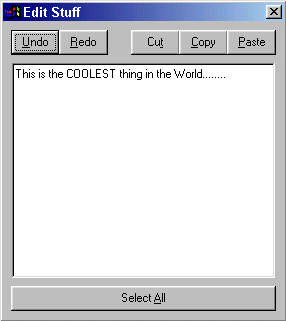



## A Unlimited Undo and Redo featured RichText Editor

### Description

This code shows you how to create Unlimited Undo and Unlimited Redo, along with Cut Copy, Paste, and Select All features, in a RichTextBox Control.
 
### More Info
 

             |
---                |---
**Submitted On**   |2000-03-03 19:53:42
**By**             |[Jason Shimkoski](https://github.com/Planet-Source-Code/PSCIndex/blob/master/ByAuthor/jason-shimkoski.md)
**Level**          |Beginner
**User Rating**    |4.2 (93 globes from 22 users)
**Compatibility**  |VB 5\.0, VB 6\.0
**Category**       |[String Manipulation](https://github.com/Planet-Source-Code/PSCIndex/blob/master/ByCategory/string-manipulation__1-5.md)
**World**          |[Visual Basic](https://github.com/Planet-Source-Code/PSCIndex/blob/master/ByWorld/visual-basic.md)
**Archive File**   |[CODE\_UPLOAD3768332000\.zip](https://github.com/Planet-Source-Code/jason-shimkoski-a-unlimited-undo-and-redo-featured-richtext-editor__1-6400/archive/master.zip)

